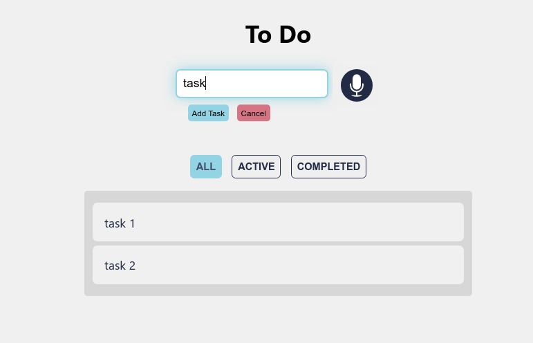

# To-Do-App

**A Minimalistic todo app Built with Redux**.


[](https://addons.mozilla.org/en-US/firefox/addon/simple-to-do/)
[](https://github.com/M-Hafez22/To-Do-App/releases/download/simple-to-do-v1.2.0/Simple.To-Do.chrome.v1.2.0.zip)



## Table of Contents

- [Features](#features)
- [Manual](#manual)
- [Clone](#clone)
- [Extension](#extension)
- [License](#license)

## Features

- A minimalist To-Do list.
- Add tasks by your voice.
- Filtering the Tasks according to the completion state.

## Manual

- You can **Add a new task** by:
  - Inserting the task message in the box and press the **Add Task** button or the **enter key**.
    Or
  - Press the **mic button** -you don't have to hold it- start talking and then press the **Add Task** button or the enter key.

- To assign a task as *completed* press the **Done** button.
- To assign a task as *not completed* press the **Undone** button.
- To *delete a task* press the **Delete** button.
- For *no touch* screens hove on the task by the cursor and task buttons (Done, Delete) will appear.
- To *Clear the input box* by one click press **Cancel**.

## Clone

To clone and run this application, you'll need Git and npm (which comes with Node.js) installed on your computer.

From your command line:

1. Clone this repository
  ```git clone https://github.com/M-Hafez22/To-Do-App.git```
2. Go into the repository
 ```cd To-Do-App```
3. Install dependencies
  ```npm install```
4. Run the app
  ```npm start```

## Extension

> It's available on Mozilla Add-ons as [Simple To-Do](https://addons.mozilla.org/en-US/firefox/addon/simple-to-do/)

### Build for firefox

1. Open [package.json](./package.json) and make sure that **homepage** set to **.** the current directory

    ```json
    "homepage": "."
    ```

2. Open [manifest.json](./public/manifest.json) in the public directory and make sure that **manifest_version** is set to **2**

    ```json
    "manifest_version": 2,
    ```

3. Now run buildextension script

    ```bash
    npm run buildextension
    ```

### Build for Chrome

> You can download the Chrome extension release from [Here](https://github.com/M-Hafez22/To-Do-App/releases/download/simple-to-do-v1.2.0/Simple.To-Do.chrome.v1.2.0.zip)

1. Open [package.json](./package.json) and make sure that **homepage** set to **.** the current directory

    ```json
    "homepage": "."
    ```

2. Open [manifest.json](./public/manifest.json) in the public directory and make sure that **manifest_version** is set to **3**

    ```json
    "manifest_version": 3,
    ```

3. Now run buildextension script

    ```bash
    npm run buildextension
    ```

## License

[](http://badges.mit-license.org)

- Licensed under the **[MIT license](LICENSE)**
- Copyright (c) 2020 Mohamed Hafez
